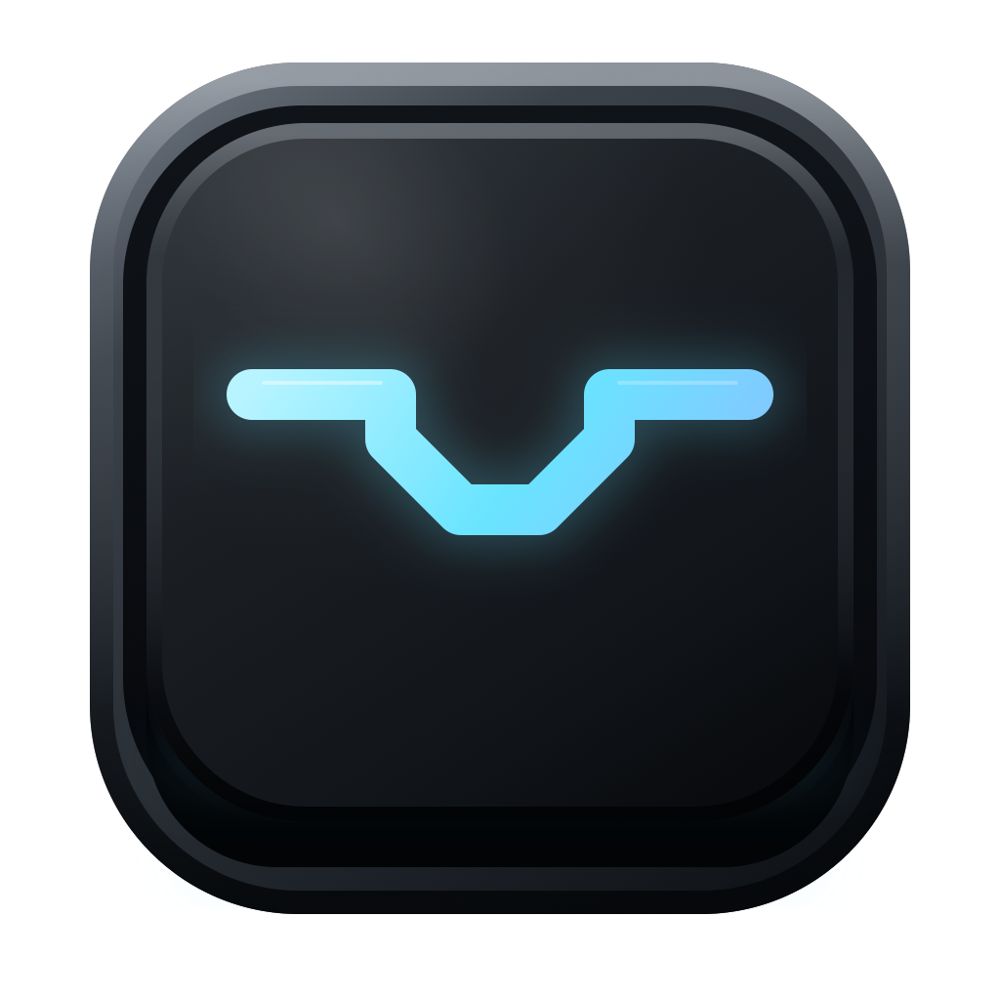

<p align="center">
  
</p>

<h1 align="center">Luma Bar</h1>

<p align="center">
  <strong>围绕 MacBook 刘海生长的原生桌面工作空间</strong><br>
  音乐 · 本地 AI Agent · 语音 · 任务提醒 · 系统控制 · 桌面宠物
</p>

<p align="center">
  <a href="README.en.md">English</a> ·
  <strong>简体中文</strong> ·
  <a href="https://github.com/Linus-Shyu/Luma-Bar/releases/latest">下载</a> ·
  <a href="#构建与运行">构建</a> ·
  <a href="#贡献">贡献</a>
</p>

<p align="center">
  <a href="https://github.com/Linus-Shyu/Luma-Bar/releases/latest"></a>
  <a href="LICENSE"></a>
  <a href="https://www.apple.com/macos/"></a>
  <a href="https://www.swift.org/"></a>
  <a href="https://github.com/Linus-Shyu/Luma-Bar/stargazers"></a>
  <a href="https://github.com/Linus-Shyu/Luma-Bar/actions/workflows/release.yml"></a>
</p>

<p align="center">
  
</p>

<p align="center">
  <em>🏆 AdventureX 2026 · 亚马逊云科技赛道 · 二等奖</em>
</p>

<br>

<p align="center">
  
</p>
<p align="center">
  <sub>始终理解当前工作空间：阅读、翻译、执行和提醒，无需离开当前界面。</sub>
</p>

## 为什么是 Luma Bar

多数菜单栏工具只做一件事。Luma Bar 把 **刘海两侧的原生安全区** 变成一块真正可工作的界面——播放音乐、调用本地 Agent、盯住 Cursor / Codex 上下文、控制 macOS，同时不遮挡摄像头。

| | |
|:--|:--|
| **原生刘海** | 使用 `auxiliaryTopLeftArea` / `auxiliaryTopRightArea`，摄像头居中不被盖住 |
| **音乐与歌词** | 本地音频、网易云歌单、实时封面 / 进度 / 同步歌词 |
| **本地 AI Agent** | 流式回复、长期偏好、近期操作上下文、需确认的本地动作 |
| **Cursor / Codex** | 上下文窗口用量 + 任务完成时刘海内提醒 |
| **Voice Whisper** | `⌘ ⇧ M` 将中文语音写入 Agent 输入框 |
| **系统控制** | 播放、音量、亮度、Wi-Fi、外观、应用、信息、锁屏 |
| **桌面宠物** | 随时间、天气与当前应用反应 |
| **全屏友好** | Spaces / 全屏切换时平滑隐藏与恢复 |

## 快速开始

### 下载（推荐）

从 [Releases](https://github.com/Linus-Shyu/Luma-Bar/releases/latest) 获取 **已公证** 的 DMG / ZIP，打开即可用。

喜欢这个项目？点一下 [★ Star](https://github.com/Linus-Shyu/Luma-Bar) —— 这对开源项目帮助极大。

### 从源码构建

```bash
git clone https://github.com/Linus-Shyu/Luma-Bar.git
cd Luma-Bar
./build_app.sh
open "luma bar.app"
```

开发迭代：

```bash
swift build
./run.sh
```

需要 **macOS 14+**、Swift 6 工具链；推荐带摄像头刘海的 MacBook。网易云 / `.ncm` 需安装网易云音乐；远程模型需 OpenAI API Key。

## 实机截图

<details open>
<summary><strong>音乐成为刘海的一部分</strong></summary>
<br>
<p align="center">
  
</p>
</details>

<details>
<summary><strong>有性格的系统监视器</strong></summary>
<br>
<p align="center">
  
</p>
</details>

<details>
<summary><strong>上下文接近上限时</strong></summary>
<br>
<p align="center">
  
</p>
</details>

## 权限与隐私

按需授权即可：辅助功能、麦克风 / 语音识别、自动化、通讯录；仅当 Cursor / Codex 数据在受保护目录时才需要完全磁盘访问。任务完成提醒画在刘海内，**不走通知中心**。

Luma Bar **本地优先**：API Key 只存钥匙串，不会进 Git；近期操作上下文会过期；只有你主动调用需要远程模型的 Agent 功能时才会发请求。

```bash
export OPENAI_API_KEY="..."
export LUMA_BAR_OPENAI_MODEL="..."
```

也可在 Agent 面板里直接保存 Key。

## 技术栈（简）

- **SwiftUI** — 紧凑栏、展开面板、主题
- **AppKit** — 无边框 `NSPanel`（刘海 + 宠物）
- **MediaRemote / AVFoundation** — 播放状态与本地播放
- **SQLite** — Cursor / Codex / 网易云本地元数据（可用时）
- **Keychain** — 模型凭据

## 荣誉

**AdventureX 2026** — **亚马逊云科技（Amazon Web Services）赛道 · 二等奖**

`#adventurex2026`

## 贡献

欢迎 Issue 与 PR。请先读 [CONTRIBUTING.md](CONTRIBUTING.md)。安全相关请看 [SECURITY.md](SECURITY.md)。

要点：保持 diff 聚焦；**Liquid Glass 视觉层已冻结**，默认请勿改动外观。

## 许可证

[MIT](LICENSE) © Luma Bar Core Team

---

<p align="center">
  如果 Luma Bar 让你的 Mac 更好用一点，请考虑
  <a href="https://github.com/Linus-Shyu/Luma-Bar">给仓库一个 Star</a>。
</p>
