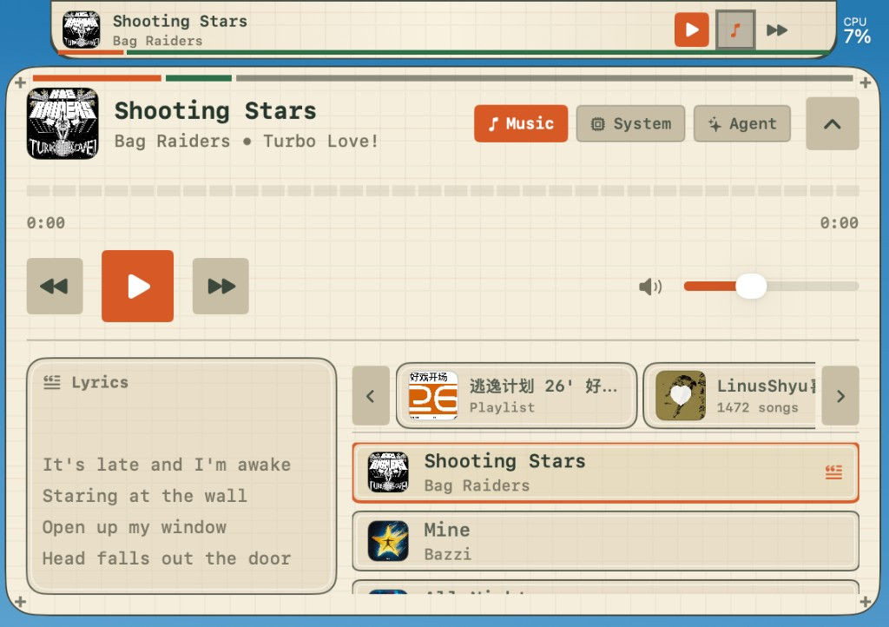
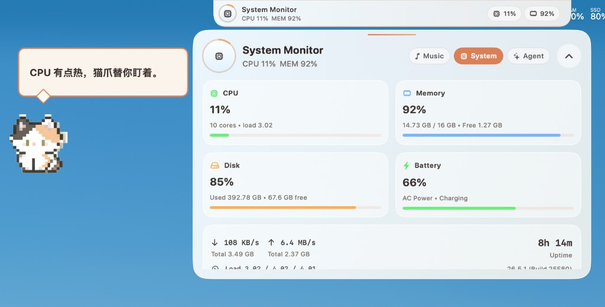
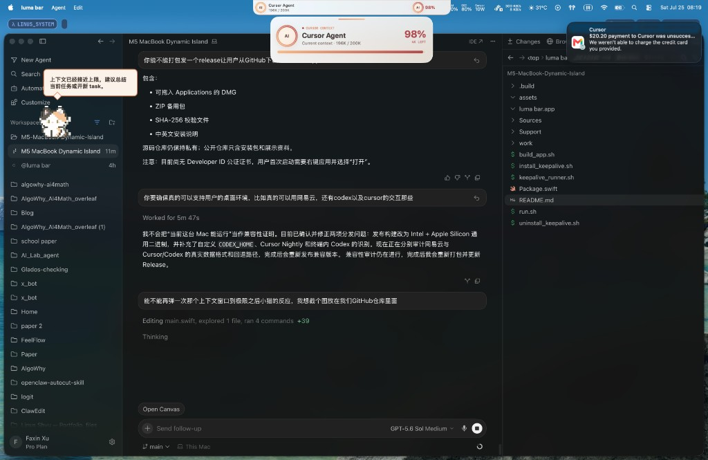
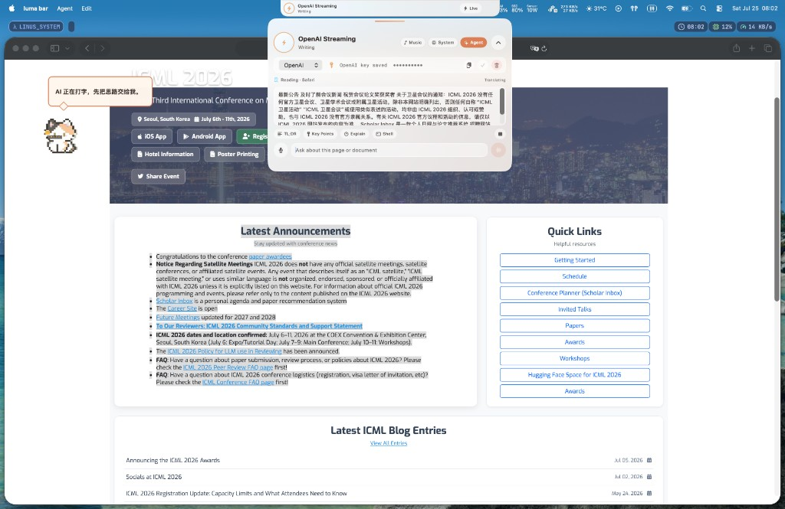

# Luma Bar [](https://github.com/Linus-Shyu/Luma-Bar/releases/latest)

Luma Bar 是围绕 Mac 摄像头刘海生长的原生 macOS 桌面工作空间：在刘海两侧安全区里承载音乐、本地 AI Agent、语音输入、任务完成提醒、系统控制与桌面宠物，同时不遮挡中间摄像头。

> [!NOTE]
> English documentation: [README.en.md](README.en.md).

### 核心能力

1. **原生刘海布局** — 使用 `auxiliaryTopLeftArea` / `auxiliaryTopRightArea`，摄像头居中不被盖住
2. **音乐与歌词** — 本地音频、网易云歌单，实时封面 / 进度 / 同步歌词
3. **本地 AI Agent** — 流式回复、长期偏好、近期操作上下文、需确认的本地动作
4. **Cursor / Codex / DeepSeek Harness 感知** — 上下文窗口用量，任务完成时在刘海内提醒
5. **Voice Whisper** — `⌘ ⇧ M` 将语音写入 Agent 输入框
6. **系统控制** — 播放、音量、亮度、Wi-Fi、外观、应用、锁屏等
7. **桌面宠物** — 随时间、天气与前台应用反应
8. **全屏友好** — Spaces / 全屏切换时平滑隐藏与恢复

更细的开源说明见 [docs/OPEN_SOURCE.md](docs/OPEN_SOURCE.md)。

## 目录

- [亮点](#亮点)
- [开始使用](#开始使用)
- [第一次运行](#第一次运行)
- [截图](#截图)
- [权限与隐私](#权限与隐私)
- [关于本仓库](#关于本仓库)
- [致谢](#致谢)
- [贡献](#贡献)
- [许可证](#许可证)

### 亮点

- **宽松的 Apache 2.0 许可：** 可自由实验、定制与商用（含专利授权；商标另见 `NOTICE`）。
- **刘海原生，而非悬浮贴片：** 贴合系统给的安全区几何，外接无刘海屏会居中并对称避让菜单栏图标。
- **本地优先：** API Key 进钥匙串；不把密钥写进 Git；只有你主动调用需要远程模型的 Agent 时才会发请求。
- **多主题：** Void / Grid / Arcade / Nook / Horizon / Forge / Aura（Aura 可调毛玻璃浓淡）。
- **AdventureX 2026：** Quick Quick Amazon Quick 赛道二等奖。

## 开始使用

需要 **macOS 14+** 与 Swift 6 工具链。推荐带摄像头刘海的 Mac。

### 下载（推荐）

从 [Releases](https://github.com/Linus-Shyu/Luma-Bar/releases/latest) 获取已公证的 DMG / ZIP，打开即可用。

### 从源码构建

```bash
git clone https://github.com/Linus-Shyu/Luma-Bar.git
cd Luma-Bar
./build_app.sh
open "luma bar.app"
```

开发迭代：

```bash
swift build
./run.sh
```

网易云 / `.ncm` 需安装网易云音乐。使用远程模型时准备 OpenAI API Key（或其它你在 Agent 面板配置的提供商）。

## 第一次运行

```bash
export OPENAI_API_KEY="..."
# 可选：
export LUMA_BAR_OPENAI_MODEL="..."

./build_app.sh
open "luma bar.app"
```

也可在 Agent 面板里直接保存 Key。首次启动按需授权辅助功能、麦克风 / 语音识别、自动化等；任务完成提醒画在刘海内，**不经过通知中心**。

## 截图

**音乐**



**系统与宠物**



**上下文接近上限**



**Agent 工作区**



## 权限与隐私

按需授权：辅助功能、麦克风 / 语音识别、自动化、通讯录；仅当 Cursor / Codex 数据位于受保护目录时才需要完全磁盘访问。

Luma Bar 坚持本地优先：近期操作上下文会过期；密钥不进仓库。细节见 [SECURITY.md](SECURITY.md)。

## 关于本仓库

本仓库提供完整应用源码、构建脚本与文档，许可证为 [Apache License 2.0](LICENSE)。归因见 [`NOTICE`](NOTICE)。

实现栈概览：

- **SwiftUI** — 紧凑栏、展开面板、主题
- **AppKit** — 无边框 `NSPanel`（刘海 + 宠物）
- **MediaRemote / AVFoundation** — 播放状态与本地音频
- **SQLite** — Cursor / Codex / 网易云本地元数据（可用时）
- **Keychain** — 模型凭据

`docs/COMMERCIALIZATION.md` 等文件可能仍保留早期产品实验记录；与许可证冲突时以 `LICENSE` / `NOTICE` 为准。

## 致谢

依赖与运行时能力离不开这些生态：

- [Swift](https://www.swift.org/) / SwiftUI / AppKit
- Apple Music、网易云音乐等本机播放器（通过官方或本地接口，非附属产品）
- Cursor / Codex 本地会话数据（只读探测，非附属产品）

我们会持续把 Luma Bar 作为开源项目维护，方便社区在此之上扩展。

## 贡献

欢迎 Issue 与 PR。请先阅读：

- [CONTRIBUTING.md](CONTRIBUTING.md)
- [CODE_OF_CONDUCT.md](CODE_OF_CONDUCT.md)
- [SECURITY.md](SECURITY.md)

请保持 diff 聚焦。**岛条视觉层已冻结**，默认请勿改外观。**请勿修改** `.github/workflows/` 下的发布 / 公证流水线，除非维护者明确要求。

## 许可证

本项目采用 [Apache License 2.0](LICENSE)。
