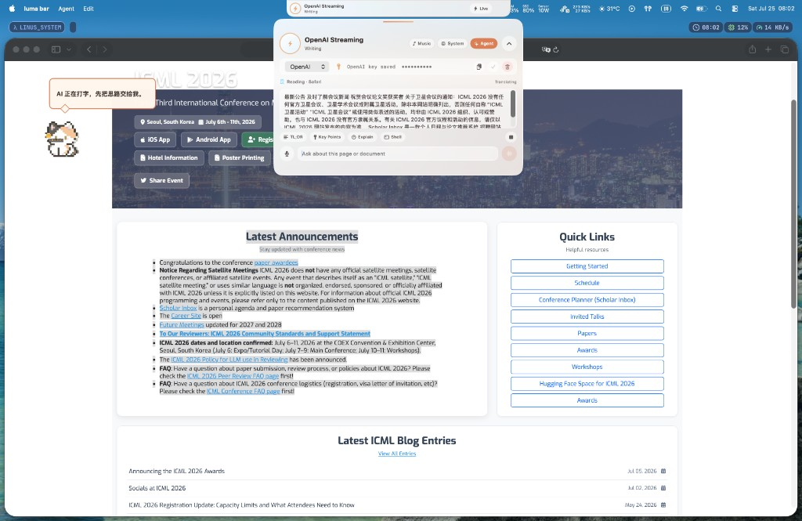
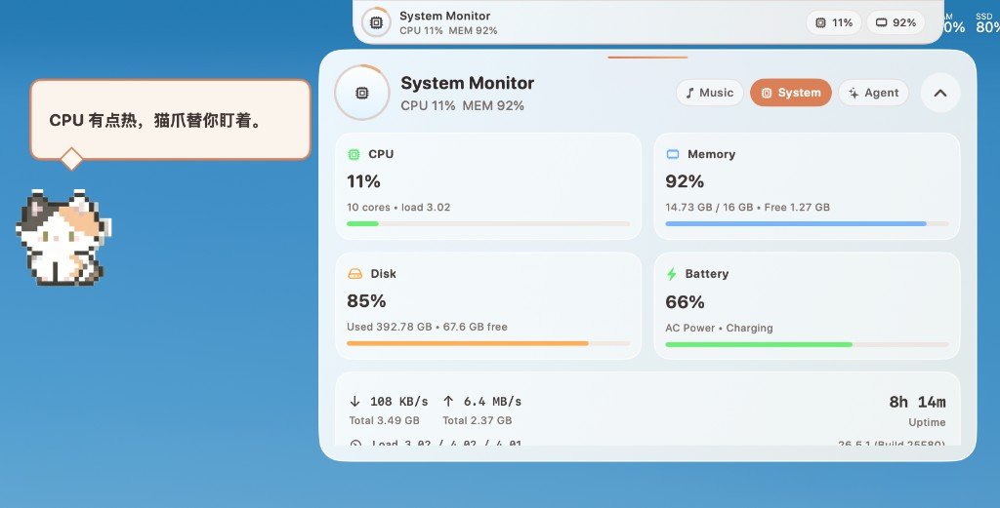

# Luma Bar

> 围绕 MacBook 刘海生长的桌面工作空间。

[English](README.md) | **简体中文**

[](https://www.apple.com/macos/)
[](https://www.swift.org/)
[](https://developer.apple.com/xcode/swiftui/)
[](#adventurex-2026)
[](https://github.com/Linus-Shyu/Luma-Bar-Download/releases/latest)

Luma Bar 是一款围绕 MacBook 摄像头刘海打造的原生 macOS 灵动岛。它将音乐播放、上下文感知本地 Agent、语音输入、任务完成提醒、系统控制和桌面宠物整合进一个轻量界面。

<p align="center">
  
</p>
<p align="center">
  <sub>始终理解当前工作空间：阅读、翻译、执行和提醒，无需离开当前界面。</sub>
</p>

## 核心亮点

- **原生刘海布局**——利用 MacBook 摄像头两侧区域，不遮挡中间摄像头。
- **音乐与歌词**——扫描本地音频、读取网易云音乐歌单，并展示实时封面、进度和同步歌词。
- **本地 AI Agent**——基于 OpenAI 的流式回复、长期偏好、近期操作上下文和需确认的本地操作。
- **Cursor 与 Codex 感知**——显示上下文窗口用量，并在单个任务完成时于刘海内弹出提醒。
- **Voice Whisper**——按下 `⌘ ⇧ M`，将中文语音直接转写到 Agent 输入框。
- **macOS 系统控制**——控制播放、音量、亮度、Wi-Fi、外观、应用、信息发送和锁屏。
- **上下文桌面宠物**——根据时间、天气和当前应用主动做出反应。
- **全屏友好**——在全屏与桌面 Space 切换时平滑隐藏和恢复灵动岛与宠物。
- **多套视觉主题**——包含 AdventureX、玻璃和像素宠物等主题。

## 实机截图

### 让音乐成为刘海的一部分

封面、歌单、播放控制、进度和同步歌词集中在同一个展开界面中。AdventureX 主题将播放器变成一块可触摸的硬件控制台。

<p align="center">
  
</p>

### 有性格的系统监视器

实时 CPU、内存、磁盘、电池、网络和运行时间数据，与能够感知上下文的像素宠物共同呈现在桌面上。

<p align="center">
  
</p>

### 上下文接近上限时

当 Cursor 或 Codex 的上下文窗口接近极限时，刘海会展开为实时用量仪表盘，桌面宠物也会提前提醒你，避免会话突然崩掉。

<p align="center">
  
</p>

## 下载

你可以从公开的 [Luma Bar 下载仓库](https://github.com/Linus-Shyu/Luma-Bar-Download/releases/latest) 获取可直接安装的 DMG。该二进制分发仓库不包含任何源码。

## 环境要求

- macOS 14 或更高版本
- 已安装 Swift 6 工具链的 Mac
- 推荐使用带摄像头刘海的 MacBook
- 如需网易云歌单及 `.ncm` 集成，需要安装网易云音乐
- 如需远程模型功能，需要 OpenAI API Key

## 构建与运行

克隆仓库并执行：

```bash
git clone https://github.com/Linus-Shyu/Luma-Bar.git
cd Luma-Bar
./build_app.sh
open "luma bar.app"
```

开发模式：

```bash
swift build
./run.sh
```

`build_app.sh` 会创建并签名本地 `luma bar.app`。生成的应用包、构建产物和本地工作数据不会提交到 Git。

## 系统权限

根据启用的功能，Luma Bar 可能会请求以下 macOS 权限：

- 辅助功能：读取当前窗口上下文并检测全屏状态
- 麦克风与语音识别：使用 Voice Whisper
- 自动化：控制音乐、信息和系统外观
- 通讯录：解析消息接收人
- 完全磁盘访问：仅当 Cursor 或 Codex 的会话数据位于受保护目录时需要

Cursor 与 Codex 的任务完成提醒直接绘制在刘海内，不走通知中心，因此无需通知权限。

只需授予你实际使用的功能所需要的权限。

## Agent 模型

API Key 保存在 macOS 钥匙串中，不会被提交到仓库。

支持以下环境变量：

```bash
export OPENAI_API_KEY="..."
export LUMA_BAR_OPENAI_MODEL="..."
```

你也可以直接在 Agent 仪表盘中保存 API Key。

## 工作原理

- **SwiftUI** 负责紧凑栏、展开仪表盘、通知和主题渲染。
- **AppKit** 管理刘海周围及桌面宠物使用的无边框 `NSPanel`。
- **MediaRemote / AVFoundation** 提供实时播放状态与本地音频播放。
- **SQLite** 在可用时读取 Cursor、Codex 和网易云音乐的本地元数据。
- **辅助功能 API** 提供当前窗口上下文与可靠的全屏检测。
- **Keychain** 在本地保存模型提供商凭据。

紧凑灵动岛使用 `NSScreen.auxiliaryTopLeftArea` 和 `auxiliaryTopRightArea`，不会覆盖中间摄像头区域。

## 隐私

Luma Bar 坚持本地优先。API Key 始终保存在钥匙串中，近期操作上下文会自动过期。只有在你主动调用需要远程模型的 Agent 功能时，相关请求才会发送给当前选择的模型提供商。

## AdventureX 2026

Luma Bar 正在为 **AdventureX 2026** 开发。

`#adventurex2026`

## 项目状态

当前项目仍处于积极迭代的原型阶段。macOS API、媒体播放器元数据和第三方应用的本地存储格式可能会随版本变化。
